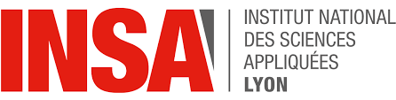

---
title: "Education"
permalink: /education/
layout: single
sidebar:
  nav: "main"
--- 

## INSA Lyon (National Institute of Applied Sciences) 

(September 2022 - August 2025)

**Engineering degree in Bioinformatics and Modeling (equivalent Msc degree)** | **GPA = 3.9/4.0**

### Main Topics : 
Data Analysis / Omics / Sequencing / Statistics / Computer Science / Artificial Intelligence / Biomathematics / Chemistry / Physiology / General Biology / Cellular Biology

### Projects

### A few words about this programm

### Syllabus
If you are curious about the full list of courses followed during this formation follow this [link].

## Yonsei University 

(September 2024 - January 2025)

**Academic exchange - Applied Statistics and Data Science Department** | **GPA = 4.06**

### Courses followed :
Computer Vision for Data Science / Statistical Pattern Recognition / Quantum Data Science / Functional Genomics / Korean Language Beginner Level III

### Projects

### A few words about this experience

(June 2023 - August 2023)

**Yonsei International Summer School** | **GPA= 4.30**

### Courses followed : 
AI & Design / Korean Language Beginner Level I

### Projects

### A few words about this experience

## Preparatory Classes for Grandes Ecoles 

(September 2020 - August 2022)

## A few words about this programm

## Main topics

